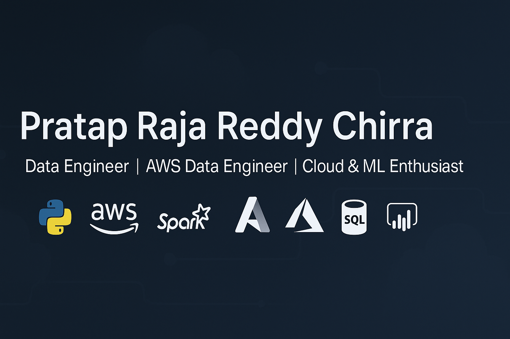

<!-- Profile README for: prataprajareddy2337-cell -->

  <!-- If you upload a header image to this repo (e.g., header.png), update the src below -->
  

  

### 👋 About Me
- Python + AWS developer focused on robust data pipelines, analytics, and ML.
- Currently building ETL on **AWS (S3, RDS, Lambda)** with **Python + SQL**.
- Open to collaborating on data engineering, MLOps, and ML projects.
- 📬 **prataprajareddy2337@gmail.com** · 📍 San Antonio, TX · [LinkedIn](https://linkedin.com/in/prataprajareddychirra/)

---

### 🛠️ Tech Stack

---

### 🚀 Featured Projects

  
<b>COVID-19 Data Pipeline</b> · Python · AWS S3/RDS · Power BI

- End-to-end ETL: ingest → clean → aggregate → visualize  
- Python + SQL; storage in S3/RDS; dashboards in Power BI  
- Repo: https://github.com/prataprajareddy2337-cell/covid-data-pipeline  
- Try notebook (Binder): https://mybinder.org/v2/gh/prataprajareddy2337-cell/covid-data-pipeline/HEAD  
- Focus: reproducible workflows, quality checks, and low-latency reporting

  
<b>Inventory Classification & Forecast Optimization</b> · Python · SQL · AWS

- ABC analysis on 68k+ SKUs; −22% inventory ageing; +18% stocking efficiency  
- Forecasting + BI visuals; data in S3; refresh checks for freshness

  
<b>Cash Flow & Revenue Pipeline Optimization</b> · Python · Airflow

- Automated batch workflows; 70% faster SQL; reporting latency cut 12h → <2h  
- Patterns: idempotent tasks, retries, alerts, and SLA-based refreshes

---

### 📈 GitHub Stats

  
  

  

---

### 🎧 Now Playing

  

---

### 🤝 Connect
**Email:** prataprajareddy2337@gmail.com · **LinkedIn:** https://linkedin.com/in/prataprajareddychirra/

### 👀 Visitor Counter

